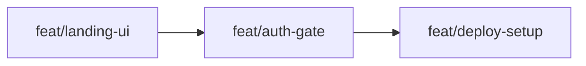

# Worktree Context
> Auto-generated by branch.py. Do not commit — see .gitignore.

## approach.md


---
summary: "Sequential, three-partition plan for a small solo Next.js app. feat/landing-ui scaffolds the Next.js project and ports the approved mock-up into the public landing/login page (fonts, assets, responsive single-viewport layout). feat/auth-gate adds the session lib, login/logout routes, and the default-deny middleware with a public allowlist, plus a placeholder gated page — depends on landing-ui. feat/deploy-setup wires Vercel env secrets, re-points cartercripe.com off the old placeholder, verifies the self-hosted font, and runs the interactive setup walkthrough — depends on auth-gate. No PRs (direct merges) per lifecycle."
phase: "approach"
when_to_load:
  - "When starting registered feature branches or reviewing partition scope, sequencing, and dependencies."
  - "When deciding what work can proceed in parallel and what must wait."
depends_on:
  - "prd.md"
  - "ux.md"
  - "tech-design.md"
modules:
  - "app/ (Next.js)"
  - "middleware.ts + lib/session.ts (auth)"
  - "Vercel deploy + public/ assets"
index:
  strategy: "## Strategy"
  partitions: "## Partitions (Feature Branches)"
  sequencing: "## Sequencing"
  migrations_compat: "## Migrations & Compat"
  risks: "## Risks & Mitigations"
  alternatives: "## Alternatives Considered"
next_section: "Done — ready for Tasks"
---

# Approach: temp-login-page

## Strategy

**Sequential, three partitions.** This is a small solo build, so the partitions are thin and mostly serial: you need the app scaffolded and the login UI present before wiring auth, and the gate working before deploying. The scaffold lives in the first partition as the shared foundation. There is no PR ceremony (lifecycle = direct merges to `initiative/` then `main`).

The deliberate ordering keeps the security-critical work (the gate) on its own branch with a focused acceptance test, and isolates the interactive ops work (Vercel/domain/walkthrough) at the end where Carter is in the loop.

## Partitions (Feature Branches)

### Partition 1: Landing UI & Scaffold → `feat/landing-ui`
**Modules**: `app/`, `app/globals.css`, `app/page.tsx`, `app/login-form.tsx`, `public/`
**Scope**: Scaffold the Next.js App Router (TypeScript) project; load Inter (`next/font`) and self-hosted Druk-aatie Burti; port the approved `mockups/landing-login.html` into `app/page.tsx` + `globals.css`; build the `LoginForm` client component (UI + states, not yet wired to a backend); add `public/resume.pdf` placeholder and a hard-hat/cone favicon; re-tune the crane/P offsets against the real display font; verify the single-viewport (no-scroll) responsive layout.
**Dependencies**: None (foundation).

#### Artifact Type
web-ui (Next.js full-stack app, UI-only at this stage)

#### How to Run
- start: `npm run dev`
- ready-check: `GET http://localhost:3000 returns 200`
- teardown: `Ctrl+C`

#### Acceptance Criteria
- [ ] `npm run dev` serves the landing page at `/` returning 200.
- [ ] Page fits a single viewport with no scroll at 1440×900 and 390×844; login card is centered, name+crane above, audience lines below. <!-- NEEDS MANUAL REVIEW -->
- [ ] Heading renders `CARTER CRI_E` with the real **P** hoisted by the crane (Druk-aatie Burti loaded, not the Oswald stand-in). <!-- NEEDS MANUAL REVIEW -->
- [ ] Resume link points to `/resume.pdf` (200) and contact link is `mailto:carter.cripe@gmail.com`.
- [ ] No secrets and no auth logic present in this partition.

#### Implementation Steps
1. `npx create-next-app@latest` (TypeScript, App Router, no Tailwind) into the repo.
2. Add fonts: Inter via `next/font/google`; Druk-aatie Burti via `next/font/local` or `@font-face` from `public/fonts/`.
3. Port mock-up markup/CSS into `app/page.tsx` + `app/globals.css`; extract `LoginForm` as a client component with idle/error/submitting states.
4. Add `public/resume.pdf` (placeholder ok) and favicon.
5. Re-tune `.lift-slot` width and `.lifted-p` offset/rotation for the real font.
6. Verify responsive single-viewport behavior + the short-screen scroll fallback.

### Partition 2: Auth & Gate → `feat/auth-gate`
**Modules**: `lib/session.ts`, `app/api/login/route.ts`, `app/api/logout/route.ts`, `middleware.ts`, `app/preview/page.tsx`, `.env.example`
**Scope**: Implement the sealed-cookie session (`iron-session`), the login route (constant-time password check + remember-me cookie lifetime), the logout route, and the default-deny `middleware.ts` with the `PUBLIC_PATHS` allowlist. Wire `LoginForm` to `/api/login`. Add a placeholder gated page `/preview` to prove enforcement. Document env vars in `.env.example`.
**Dependencies**: Requires Partition 1 (needs the scaffold + the login form to wire).

#### Artifact Type
full-stack (Next.js routes + middleware)

#### How to Run
- start: `npm run dev` (set `SITE_PASSWORD` and `SESSION_SECRET` in `.env.local` first)
- ready-check: `GET http://localhost:3000 returns 200`
- teardown: `Ctrl+C`

#### Acceptance Criteria
- [ ] `curl -i http://localhost:3000/preview` with no cookie returns a redirect (302/307) to `/` — gate enforced server-side without JS.
- [ ] `curl -i http://localhost:3000/resume.pdf` returns 200 (public allowlist).
- [ ] Correct password at `/api/login` sets an `httpOnly` `secure` session cookie and grants `/preview`; wrong password returns 401 with a generic error and no cookie.
- [ ] "Keep me logged in" checked ⇒ ~30-day cookie; unchecked ⇒ session cookie (verify `Max-Age`/`Expires`).
- [ ] `SITE_PASSWORD`/`SESSION_SECRET` never appear in the client bundle or any response body.

#### Implementation Steps
1. `npm i iron-session`; write `lib/session.ts` (cookie name, secret, options, `getSession`).
2. `app/api/login/route.ts`: parse `{password, remember}`, `timingSafeEqual` vs `SITE_PASSWORD`, seal session with conditional lifetime, redirect to `?from`/`/preview`.
3. `app/api/logout/route.ts`: destroy session, redirect to `/`.
4. Wire `LoginForm` submit to `/api/login`; render the 401 error state.
5. `middleware.ts`: default-deny + `PUBLIC_PATHS` + static/font matcher; redirect unauthenticated to `/?from=…`.
6. `app/preview/page.tsx` placeholder; run the `curl` acceptance checks.

### Partition 3: Deploy & Setup → `feat/deploy-setup`
**Modules**: `.env.example`, `next.config.js`, `README.md` (setup guide), Vercel project settings (external)
**Scope**: Production readiness + the interactive walkthrough Carter asked for. Configure Vercel env vars (`SITE_PASSWORD`, `SESSION_SECRET`), re-point cartercripe.com from the old placeholder deployment to this app, verify the self-hosted font in production, and document setup in `README.md`. Include forward-pointers for the v3 Supabase upgrade (no implementation).
**Dependencies**: Requires Partition 2 (gate must work before going live).

#### Artifact Type
web-ui (deployment + docs)

#### How to Run
- start: `vercel` (preview deploy) then `vercel --prod`
- ready-check: `curl -i https://<preview-url>/preview returns a redirect; https://<preview-url>/ returns 200`
- teardown: n/a (managed deployment)

#### Acceptance Criteria
- [ ] Production deploy on cartercripe.com over HTTPS serves the new page (old placeholder replaced). <!-- NEEDS MANUAL REVIEW -->
- [ ] `curl -i https://cartercripe.com/preview` (no cookie) redirects to `/`; `/` and `/resume.pdf` return 200.
- [ ] Env secrets set in Vercel (Production), not committed. <!-- NEEDS MANUAL REVIEW -->
- [ ] Druk-aatie Burti renders in production (no FOUT/fallback-only). <!-- NEEDS MANUAL REVIEW -->
- [ ] `README.md` documents env vars, local run, and the domain/setup steps.

#### Implementation Steps
1. Write `.env.example` + `README.md` setup section.
2. **Walkthrough (interactive with Carter):** create/confirm the Vercel project, set env vars, link the repo, preview deploy.
3. Re-point cartercripe.com domain to this project (swap from the old placeholder).
4. Verify production: `curl` gate checks + visual font check.
5. Note v3 Supabase upgrade path in README (deferred).

## Sequencing



### Partitions DAG

```yaml partitions
- name: feat/landing-ui
  modules: [app, public]
  depends_on: []

- name: feat/auth-gate
  modules: [lib, middleware, app/api, app/preview]
  depends_on: [feat/landing-ui]

- name: feat/deploy-setup
  modules: [vercel, readme, env]
  depends_on: [feat/auth-gate]
```

## Migrations & Compat
No data migrations. The only production cutover is re-pointing cartercripe.com from the existing blank-placeholder Vercel deployment to this app — do this last (Partition 3) after the gate is verified, so the domain only flips when the new site is ready.

## Risks & Mitigations
| Risk | Mitigation |
|------|------------|
| Domain flip breaks the live placeholder prematurely | Flip only in P3 after preview-deploy verification; keep the change reversible in Vercel. |
| iron-session Edge incompatibility in middleware | Fallback to `jose` HS256 JWT verification (noted in tech-design ADR-2/risks). |
| Font re-tune drifts the P/crane alignment | Dedicated tuning step in P1 against the real font; manual visual acceptance. |
| Secret leakage via client import | Keep secrets in route/middleware only; `.env.local` gitignored; verify bundle. |

## Alternatives Considered
- **Static site + Vercel project password:** rejected — it gates the whole deployment, breaking the public allowlist (`/`, `/resume.pdf`).
- **Supabase Auth now:** rejected for MVP — accounts/DB are unneeded for a shared password; kept as the v3 upgrade.
- **Per-page auth checks instead of middleware:** rejected — error-prone (easy to forget a page); middleware default-deny is fail-safe.


## tasks.md


---
summary: "Execution checklist across three sequential partitions. feat/landing-ui: scaffold Next.js, load fonts, port the mock-up into the landing page + LoginForm, add resume/favicon, re-tune the crane/P, verify single-viewport layout. feat/auth-gate: iron-session lib, login/logout routes (constant-time compare, remember-me), default-deny middleware + allowlist, /preview placeholder, curl gate verification. feat/deploy-setup: env/.env.example/README, then the interactive Vercel + domain-swap + font-verify walkthrough. No PRs (direct merges); initiative boundary merges to main and synthesizes canon."
phase: "tasks"
when_to_load:
  - "When selecting the next implementation task or reviewing completion state."
  - "When checking partition progress, PR boundaries, or execution sequencing."
depends_on:
  - "prd.md"
  - "ux.md"
  - "tech-design.md"
  - "approach.md"
modules:
  - "app/ (Next.js)"
  - "lib/session.ts + middleware.ts"
  - "public/ assets + Vercel deploy"
index:
  partition_one: "## Partition: feat/landing-ui"
  partition_two: "## Partition: feat/auth-gate"
  partition_three: "## Partition: feat/deploy-setup"
  initiative_boundary: "## Initiative Boundary"
next_section: "## Partition: feat/landing-ui"
---

# Tasks: temp-login-page

<!-- Lifecycle: no PRs at feature or initiative boundaries (direct merges). -->

## Partition: feat/landing-ui

- [x] Scaffold Next.js App Router + TypeScript (no Tailwind) into the repo; confirm `npm run dev` serves `/` with 200 <!-- id: 1 --> (manual scaffold via package.json; `next build` clean, `/`→200)
- [x] Load fonts: Inter via `next/font/google`; self-host Druk-aatie Burti via `next/font/local` (or `@font-face`) from `public/fonts/` <!-- id: 2 --> (Inter + DrukaatieBurti-Bold.ttf via next/font/local in app/layout.tsx)
- [x] Port `mockups/landing-login.html` markup + CSS into `app/page.tsx` (Server Component) and `app/globals.css` <!-- id: 3 -->
- [x] Extract `app/login-form.tsx` (Client Component) with idle / submitting / error states (not yet wired to a backend) <!-- id: 4 -->
- [x] Add `public/resume.pdf` (placeholder acceptable) and a hard-hat/cone `favicon.ico`; wire resume link to `/resume.pdf` and contact to `mailto:carter.cripe@gmail.com` <!-- id: 5 --> (real resume.pdf already present; favicon = app/icon.svg hard-hat; links verified, /resume.pdf→200 application/pdf)
- [x] Re-tune `.lift-slot` width + `.lifted-p` offset/rotation against the real Druk-aatie Burti so `CARTER CRI_E` + hoisted P look right <!-- id: 6 --> (set Druk-tuned values: slot 0.56em, P bottom 0.5em/12°, crane bottom 1.12em — **final pixel nudge needs human visual review in browser**)
- [~] Verify single-viewport (no-scroll) layout at 1440×900 and 390×844, plus the `max-height:620px` scroll fallback <!-- id: 7 --> (CSS implements it; **HUMAN-GATED visual confirmation in a browser pending** — couldn't render headlessly)
- [x] Reflect + Code Review on `feat/landing-ui`, then merge into `initiative/temp-login-page` <!-- id: 8 --> (Code Review PASS advisory; merged --no-ff)

## Partition: feat/auth-gate

- [x] `npm i iron-session`; write `lib/session.ts` (cookie name, `SESSION_SECRET`, httpOnly/secure/sameSite options, `getSession` helper) <!-- id: 10 --> (iron-session v8; cookie `cc_site`)
- [x] `app/api/login/route.ts`: parse `{password, remember}`, `crypto.timingSafeEqual` vs `SITE_PASSWORD`, seal session with conditional lifetime, redirect to `?from`/`/preview`; 401 + generic error on mismatch (no cookie) <!-- id: 11 --> (constant-time compare; same-site redirect guard; nodejs runtime)
- [x] `app/api/logout/route.ts`: destroy session and redirect to `/` <!-- id: 12 -->
- [x] Wire `LoginForm` submit to `/api/login`; render the 401 error state and the remember-me checkbox <!-- id: 13 --> (fetch + redirect on ok; added "Please log in to view that page" note when ?from present)
- [x] `middleware.ts`: default-deny + `PUBLIC_PATHS` allowlist (`/`, `/api/login`, `/api/logout`, `/resume.pdf`, static/font matcher); redirect unauthenticated to `/?from=…` <!-- id: 14 --> (fail-closed on errors)
- [x] `app/preview/page.tsx`: placeholder gated page proving end-to-end enforcement <!-- id: 15 --> (with logout form)
- [x] Verify gate with curl: `/preview` (no cookie) → redirect; `/` and `/resume.pdf` → 200; correct password grants `/preview`; confirm no secrets in client bundle <!-- id: 16 --> (ALL PASS: 307→/?from; 200/200; 401 wrong; 200 with cookie; Max-Age=2592000 remember vs session cookie; no password in .next/static)
- [x] `.env.example` documenting `SITE_PASSWORD` + `SESSION_SECRET` (no values) <!-- id: 17 -->
- [x] Reflect + Code Review on `feat/auth-gate`, then merge into `initiative/temp-login-page` <!-- id: 18 --> (Code Review PASS advisory; merged --no-ff)

## Partition: feat/deploy-setup

- [ ] Write `README.md` setup section (env vars, local run, domain/deploy steps) and any `next.config.js` needed <!-- id: 20 -->
- [ ] **Interactive walkthrough with Carter:** create/confirm the Vercel project, set `SITE_PASSWORD` + `SESSION_SECRET` in Vercel (Production), link the repo, run a preview deploy <!-- id: 21 -->
- [ ] Re-point cartercripe.com from the old blank-placeholder deployment to this project (only after preview verification) <!-- id: 22 -->
- [ ] Verify production: curl gate checks on cartercripe.com + visual Druk-aatie Burti font check <!-- id: 23 -->
- [ ] Document the v3 Supabase per-person-accounts upgrade path in `README.md` (deferred, no implementation) <!-- id: 24 -->
- [ ] Reflect on `feat/deploy-setup`, then merge into `initiative/temp-login-page` <!-- id: 25 -->

## Initiative Boundary

- [ ] Merge `initiative/temp-login-page` → `main` (direct, no PR per lifecycle), then synthesize canon and archive specs on `main` <!-- id: 100 -->


